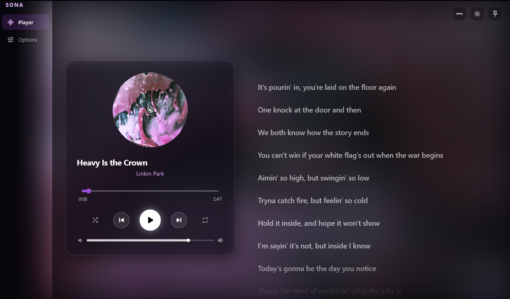

<div align="center">



# SONA

**Universal Desktop Audio Overlay & Customizable Media Controller**

[](LICENSE)
[](https://flutter.dev)
[](#-viva-lopen-source)

</div>

---

## 🎵 Overview

**SONA** is a modern, lightweight, non-intrusive desktop audio HUD and media controller built with Flutter.

The main objective of **SONA** is to seamlessly work with **any music or media player** (Spotify, YouTube Music, Apple Music, VLC, browser playback, system media sessions, and more), giving users total control over their playback experience while delivering unparalleled visual customization options.

---

## 🌟 Key Objectives & Features

* **Universal Player Compatibility:** Interfaces with system-level media session APIs to detect, display, and control whatever audio is currently playing across any application.
* **Deep Customization:** Tailor themes, overlay layouts, visualizers, HUD positioning, transparency, typography, and controls to match your desktop aesthetic.
* **Ethereal Glassmorphic Overlay:** Non-disruptive, ultra-sleek HUD design powered by dark violet glassmorphism, precise telemetry, and zero-distraction ambient visuals for gaming and creative workflows.
* **Low Footprint & High Performance:** Built on Flutter Desktop with efficient native bindings (`win32`, `ffi`, `window_manager`, `flutter_acrylic`).

---

## 🚀 W Open Source! ✊

We strongly believe in community-driven software, user freedom, and open technology. **SONA** is proudly 100% open source. 

> *"Software should be open, adaptable, and owned by the community."*

Whether you want to create custom modules, add support for new platforms, design stunning themes, or fix bugs—contribute and make SONA your own!

---

## 🛠 Tech Stack

* **Framework:** [Flutter](https://flutter.dev) (Desktop)
* **State Management:** [Riverpod](https://riverpod.dev)
* **Window & Glass FX:** `flutter_acrylic`, `window_manager`
* **Native System Interop:** `win32`, `ffi`

---

## 📦 Getting Started

### Prerequisites

* [Flutter SDK](https://docs.flutter.dev/get-started/install) (`^3.13.5` or later)
* Windows 10/11 (with C++ Build Tools installed for Desktop development)

### Running Locally

1. **Clone the repository:**
   ```bash
   git clone https://github.com/Carmine0033/Sona.git
   cd Sona
   ```

2. **Install dependencies:**
   ```bash
   flutter pub get
   ```

3. **Launch SONA:**
   ```bash
   flutter run -d windows
   ```

---

## 🤝 Contributing

Contributions are welcome! Feel free to open an issue or submit a pull request:

1. Fork the Project
2. Create your Feature Branch (`git checkout -b feature/AmazingFeature`)
3. Commit your Changes (`git commit -m 'Add some AmazingFeature'`)
4. Push to the Branch (`git push origin feature/AmazingFeature`)
5. Open a Pull Request
